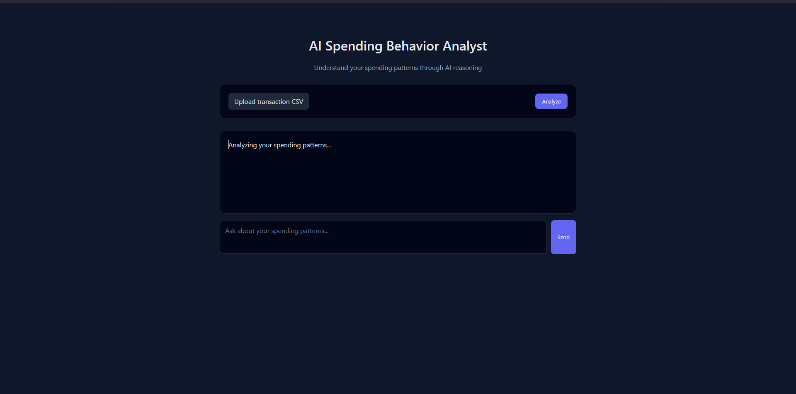
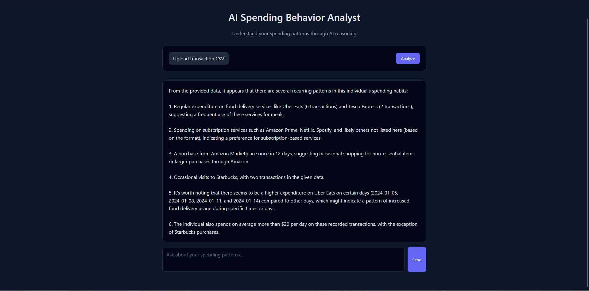
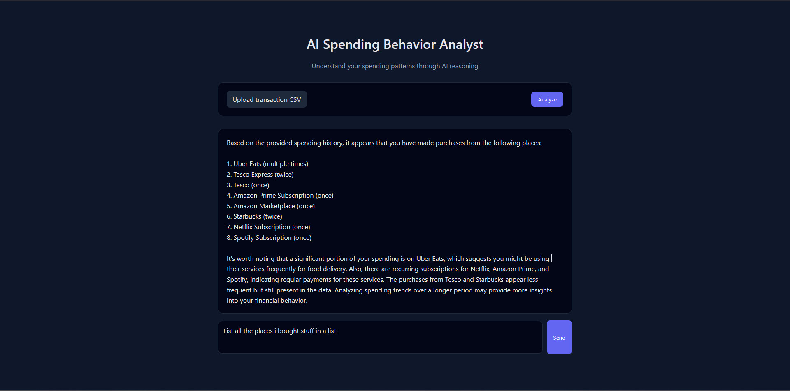
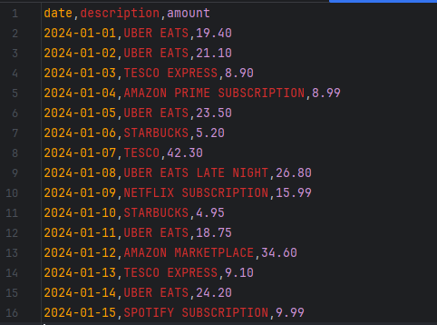

# AI Spending Behavior Analyst

A local AI-powered web app that analyzes personal spending behavior and explains patterns using natural language reasoning.

This project avoids rule-based budgeting, fixed categories, or spending limits.  
Instead, transactions are treated as text and a large language model infers behavioral patterns semantically.

---

## Features
- Upload bank transaction CSV files
- AI-generated spending behavior insights
- Chat-style follow-up questions
- Clean web interface
- Runs fully locally (no external APIs)

---

## Tech Stack
- **Backend:** Python, Flask  
- **Frontend:** HTML, CSS, JavaScript  
- **AI:** Local LLM via Ollama (Mistral)

---

## How It Works
1. CSV transactions are converted into natural language
2. A local LLM analyzes spending patterns
3. Users can ask follow-up questions conversationally

---

## Screenshots

### Uploading and Analyzing Transactions


### AI-Generated Spending Insights


### Chat-Based Follow-Up Questions


### CSV


---

## Setup & Run

### 1. Install dependencies
```bash
pip install -r requirements.txt
