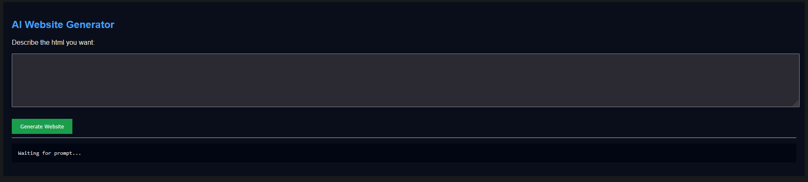
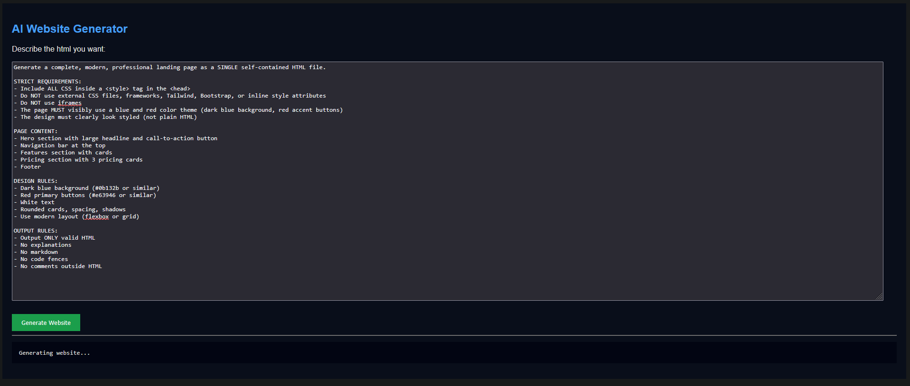

# AI Website Generator

A local AI-powered website generator that works like a mini ChatGPT for HTML/CSS websites.

Users type a prompt (e.g. “Create a blue and red landing page for a fitness coach”), and the AI generates a full HTML page which instantly replaces the preview on the screen. The generated site can also be saved to a file.

The backend uses a locally hosted LLM via Ollama, so no API keys or paid services are required.

---

## ✨ Features

- ChatGPT-style interface for website generation  
- Generates full HTML pages from natural language prompts  
- Live preview updates to the generated website  
- Save generated HTML to a file  
- “Back to Generator” button to return to the prompt screen  
- Supports inline CSS and modern layouts  
- Fully local AI (no internet or API keys needed)

---

## 🛠 Technologies Used

- Python  
- Flask  
- Ollama (local LLM)  
- HTML, CSS, JavaScript  
- Fetch API  

---

## Screenshots

### Front page of the website

### User Prompt

### AI RETURNED HTML

---

## 🚀 How to Run

### Prerequisites
- Python installed and added to PATH  
- Ollama installed and running  
- A model pulled
- Example Prompt : 
    Create a modern landing page for a fitness coach.
    Use blue and red as the main colors.
    Include a hero section, services cards, testimonials, and a call-to-action button.
    Use inline CSS inside the HTML.

